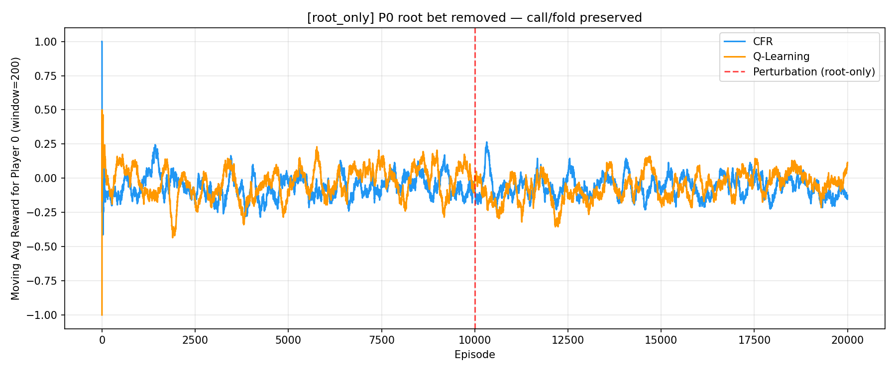

# Kuhn Poker Perturbation Experiments

How do planning and RL agents adapt when the rules change mid-game? We remove
Player 0's ability to bet in Kuhn Poker and compare CFR (frozen Nash policy)
against tabular Q-learning (self-play). The key finding: even one remaining
decision point prevents catastrophic collapse.

## Quick Start

```bash
pip install -r requirements.txt
python run_experiments.py --config configs/root_only.yaml
```

Run both experiments at once:

```bash
python run_experiments.py
```

Requires Python 3.10+. No external game libraries -- Kuhn Poker is implemented from scratch.

## Key Result

Removing all actions from an agent leads to catastrophic exploitation under
self-play (\~-0.91), while preserving even a single decision point stabilizes
behavior near equilibrium (\~-0.05).

This demonstrates a nonlinear relationship between decision capacity and
robustness in multi-agent learning.

| Perturbation | CFR | Q-Learning |
|---|---|---|
| Full removal (0 decisions left) | -0.23 | **-0.91** |
| Root-only (1 decision left) | -0.07 | **-0.05** |

## Experiments

Each experiment runs 20,000 self-play episodes. At episode 10,000 a rule
perturbation is applied to Player 0 only.

**Full removal** (`configs/full_removal.yaml`) -- Bet is removed from P0 at
*all* decision nodes. P0 cannot open-bet or call. Zero remaining decisions.
Q-learning collapses as the self-play opponent learns total exploitation.


**Root-only removal** (`configs/root_only.yaml`) -- Bet is removed from P0
at the *root* only. P0 can still call or fold when facing a bet. One remaining
decision. Q-learning stabilises near Nash equilibrium value.



### Agents

- **CFR** -- Trained to Nash equilibrium before perturbation, then frozen.
- **Q-Learning** -- Tabular, epsilon-greedy, self-play. Continues learning
  after perturbation.

## Project Structure

- `configs/` -- YAML experiment definitions
- `src/env/` -- Kuhn Poker environment and perturbation wrapper
- `src/agents/` -- CFR and Q-learning implementations
- `src/experiments/` -- Experiment runner
- `src/utils/` -- Metrics and plotting
- `results/` -- Output CSVs and plots
- `report/` -- Analysis draft
