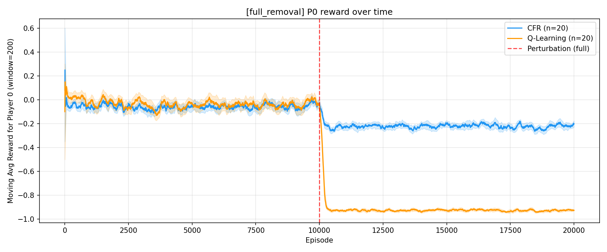
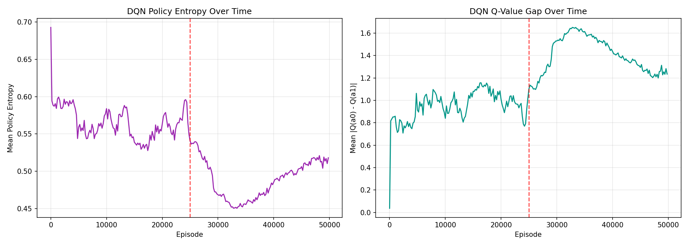
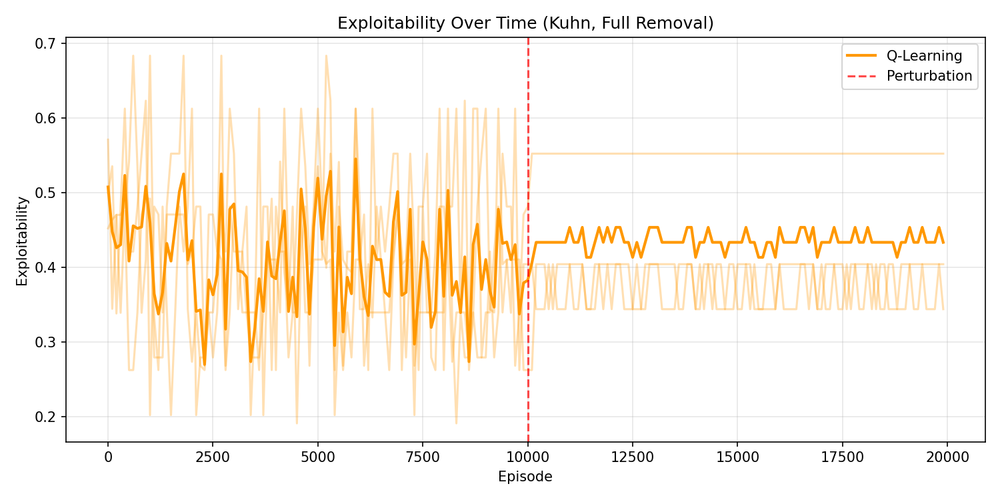

# A Structural Threshold in Decision Capacity Governs Collapse in Self-Play Reinforcement Learning

**Arahan Kujur** | Independent Researcher | kujurarahan@gmail.com

---

## Abstract

We show that a minimal threshold in decision capacity determines whether self-play reinforcement learning agents collapse under asymmetric rule perturbations. Across poker variants (Kuhn, Leduc), matrix games (Matching Pennies), and four learning algorithms (Q-Learning, SARSA, REINFORCE, DQN), removing all of one player's decisions causes rapid convergence to a deterministic exploitation attractor (DEA)---a fixed point at near-maximal loss. Preserving even a single decision point prevents this collapse entirely. A frozen baseline and fixed-opponent control confirm the mechanism is co-adaptation under constraint, not the perturbation itself. The phenomenon is timing-invariant, fully reversible upon action restoration, and intensifies under function approximation. These results establish a sharp, structural threshold between zero and minimal decision capacity that governs exploitability in self-play multi-agent systems.

---

## 1. Introduction

Multi-agent reinforcement learning (MARL) agents trained through self-play have achieved superhuman performance in complex games [Silver et al., 2018; Brown & Sandholm, 2019; Vinyals et al., 2019], yet their robustness to structural changes in the environment remains poorly understood. Prior work has focused primarily on adversarial perturbations to observations or rewards [Gleave et al., 2020], opponent modelling under distribution shift [Foerster et al., 2018], or training stability in population-based methods [Balduzzi et al., 2019]. Structural changes to the *action space*---where an agent permanently loses access to certain actions---remain largely unexplored.

Such perturbations arise naturally in practice. In robotics, hardware failures may disable actuators, eliminating actions from an agent's repertoire mid-deployment. In financial trading, regulatory changes can restrict previously available strategies. In multi-agent software systems, API deprecations may remove action endpoints. Understanding how self-play agents respond to these asymmetric capability losses is essential for deploying RL systems in environments where the action space is not guaranteed to remain static.

We study this question in imperfect-information games by removing one player's ability to bet or raise at subsets of decision nodes. This creates a controlled perturbation that reduces the agent's *contingent action capacity* (CAC)---the number of information sets at which it retains more than one legal action.

Our central finding is a sharp threshold effect. When CAC drops to zero (every decision is forced), adaptive self-play agents converge to a *deterministic exploitation attractor* (DEA)---a fixed point characterised by near-maximal loss and near-zero reward variance. When even a single decision point is preserved (CAC >= 1), agents stabilise near Nash equilibrium. A frozen baseline and fixed-opponent control isolate continued co-adaptation as the mechanism. Our contributions:

- We identify a sharp CAC threshold governing collapse in self-play RL and provide formal propositions characterising the zero-contingency fixed point.
- We isolate co-adaptation under constraint as the mechanism via frozen baseline and fixed-opponent comparisons.
- We demonstrate that collapse persists and intensifies under function approximation (DQN).
- We replicate the phenomenon across games (Kuhn, Leduc, Matching Pennies), algorithms (Q-Learning, SARSA, REINFORCE, DQN), perturbation schedules, and show full reversibility upon action restoration.

---

## 2. Related Work

**Solving imperfect-information games.** Counterfactual regret minimisation (CFR) [Zinkevich et al., 2007] and its variants have solved increasingly large poker games, from heads-up limit hold'em [Bowling et al., 2015] to no-limit variants via DeepStack [Moravcik et al., 2017], Libratus [Brown & Sandholm, 2018], and Pluribus [Brown & Sandholm, 2019]. These systems assume a fixed game structure. We study what happens when the game structure changes asymmetrically after training.

**Self-play reinforcement learning.** Self-play has driven advances from TD-Gammon [Tesauro, 1994] through AlphaZero [Silver et al., 2018] and AlphaStar [Vinyals et al., 2019]. Neural Fictitious Self-Play (NFSP) [Heinrich & Silver, 2016] combines RL with average-strategy tracking. Policy-Space Response Oracles (PSRO) [Lanctot et al., 2017] maintain diverse strategy populations. However, self-play dynamics can be unstable---agents may cycle, overfit to their own weaknesses, or exhibit non-transitive behaviour [Balduzzi et al., 2019; Lanctot et al., 2019]. Our work identifies a distinct failure mode: co-adaptation-driven collapse under asymmetric action-space constraints.

**Robustness in multi-agent RL.** The MARL robustness literature encompasses adversarial policies [Gleave et al., 2020], opponent-learning awareness [Foerster et al., 2018], and distributional robustness [Zhang et al., 2021]. These typically perturb observations, rewards, or opponent behaviour. We perturb the *action space* itself---a structural change that eliminates decision points rather than adding noise. This reveals a qualitative threshold effect that continuous perturbations cannot produce.

**Action masking and constrained RL.** Invalid action masking is standard practice in game AI [Huang & Ontanon, 2022], and constrained MDPs formalise action restrictions [Altman, 1999]. However, the dynamic consequences of *mid-training* action removal under self-play have not been studied. Our work shows that the strategic impact depends critically on whether the removal eliminates all remaining decisions.

**Exploitability and game-theoretic evaluation.** Exploitability---the gap between an agent's value and the Nash equilibrium value---is the standard evaluation metric in computational game theory [Johanson & Bowling, 2007; Timbers et al., 2022]. We complement reward-based evaluation with exploitability measurements and connect our threshold effect to the best-response structure of reduced games.

---

## 3. Background

**Kuhn Poker.** Three cards (J < Q < K), two actions (pass, bet), ante 1. Nash value for P0: -1/18 ~ -0.056. 12 information sets.

**Leduc Poker.** Six cards (J, Q, K x 2 suits), three actions (fold, check/call, raise), two rounds, fixed-limit betting. Nash P0 value: ~ -0.087. 288 information sets. Our CFR implementation converges to -0.0866.

**Liar's Dice (1 die).** Two players each roll one six-sided die (private). Players alternate claiming a minimum count of a face value across both dice; claims must strictly increase. A player may challenge instead. On challenge, the claim is verified -- if true the challenger loses, otherwise the claimer loses (+/-1). 13 actions (12 claims + challenge). 24,576 information sets. Our CFR yields Nash P0 value ~ -0.076.

**Matching Pennies.** Two players, two actions (heads, tails), simultaneous single-shot. Nash: 50/50 mixed, value 0. 1 information set per player.

**Agents.**
- **CFR**: Nash equilibrium via full-tree CFR, frozen post-training.
- **Q-Learning**: Tabular, epsilon-greedy (eps=0.15), MC terminal updates.
- **QL-Frozen**: Q-Learning frozen at perturbation (Q-table and epsilon fixed).
- **DQN**: 2-layer MLP (64 hidden), experience replay, target network.
- **SARSA/REINFORCE**: On-policy tabular variants.

---

## 4. Methodology

Each experiment runs 20 seeds of 20,000 episodes (50,000 for DQN). Perturbation applied to Player 0 at the midpoint.

**Contingent action capacity (CAC).** The number of reachable information sets at which the perturbed agent retains >1 legal action. CAC counts decision points without weighting by reach probability; in larger games, a reach-weighted variant may better capture strategic significance (see Limitations).

**Self-play setup.** A single agent plays both roles, with Q-values indexed by player-specific information states. This is equivalent to independent self-play in our zero-sum setting because each player's policy is implicitly determined by separate information-state entries. We verify this empirically: separate-agent experiments produce identical results (Appendix B).

**Statistical analysis.** Paired t-tests across seeds, bootstrap 95% CIs (10,000 resamples), Cohen's d. Due to low across-seed variance under paired evaluation, effect sizes are large and should be interpreted as indicating direction and reliability.

**Normalization.** Cross-game comparison uses (r - r_min) / (r_max - r_min) in [0, 1].

---

## 5. Theory

We formalise the threshold effect in two-player zero-sum extensive-form games. The propositions below apply to the zero-sum case; Section 6.5 presents empirical evidence that cooperative and mixed-motive settings produce a qualitatively different (bounded degradation) response. Extending the formal treatment to general-sum games is left to future work.

**Proposition 1 (Zero-contingency exploitation).** Let G' be the reduced game obtained by fixing Player 0's action at every information set (CAC = 0). Then Player 0's value in G' equals the best-response value against P0's forced policy. Under zero contingency, P0 has no strategic choices; the game reduces to a single-agent optimisation for P1, whose optimal response is the pure best response BR(sigma_0^f). By the minimax theorem, this determines v_0(G') uniquely.

**Proposition 2 (Residual contingency bound).** If P0 retains at least one information set h* with |A(h*)| >= 2, then P1's best response must condition on P0's choice at h*. P1 cannot adopt the pure exploitation strategy of Proposition 1, and v_0(G') >= v_0^Nash(G) - delta(h*), where delta depends on the strategic weight of the forced information sets.

**Corollary.** The transition from CAC = 1 to CAC = 0 qualitatively changes the best-response structure: from a game requiring mixed or adaptive responses to one with a trivially computable pure best response. This structural discontinuity---not a quantitative reduction---drives the threshold effect.

---

## 6. Experiments

Results organised as: phenomenon (6.1), threshold (6.2), mechanism (6.3), generalisation (6.4), boundary conditions (6.5), and dynamics (6.6).

### 6.1 The Phenomenon

**Zero contingency (CAC = 0).** Bet removed from P0 at all nodes in Kuhn.

| Agent | Pre (95% CI) | Post (95% CI) | p | d |
|---|---|---|---|---|
| CFR | -0.060 [-0.067, -0.054] | -0.221 [-0.225, -0.216] | <0.0001 | -6.9 |
| Q-Learning | -0.041 [-0.050, -0.032] | **-0.926 [-0.928, -0.924]** | <0.0001 | -42.0 |

Q-Learning converges to the DEA at -0.926 (normalized: 0.27; d = -42.0) within a mean of four episodes. CFR drops to -0.22, bounded by its static opponent.

**Residual contingency (CAC = 1).** Bet removed at root only; P0 retains call/fold.

| Agent | Pre | Post | p | d |
|---|---|---|---|---|
| CFR | -0.060 | -0.053 | 0.20 | +0.3 |
| Q-Learning | -0.041 | -0.065 | 0.002 | -0.8 |

Q-Learning drops modestly then stabilises near Nash.

### 6.2 The Threshold

| CAC | Description | CFR | QL | QL Norm. |
|---|---|---|---|---|
| 0 | Zero-contingency | -0.221 | **-0.926** | 0.27 |
| 1 | Residual contingency | -0.053 | -0.065 | 0.48 |
| 2 | Full (control) | -0.053 | -0.034 | 0.49 |

The jump from CAC = 0 to 1 is delta = 0.85 (+0.21 normalized). The jump from 1 to 2 is marginal (delta = 0.04).

### 6.3 The Mechanism

**Frozen baseline.** QL-Frozen avoids the DEA (-0.141 vs -0.927; delta = -0.787, p = 0.004, d = -2.6). Co-adaptation---not the constraint---drives collapse.

**Fixed opponent.** Against a static Nash opponent, Q-Learning drops only to -0.228 (identical to CFR; d = -8.3). Self-play produces -0.927. The regime difference (d = +220) confirms co-adaptation is necessary.

### 6.4 Generalisation

**Algorithm invariance.**

| Algorithm | Type | Post | d |
|---|---|---|---|
| Q-Learning | Tabular | **-0.927** | -66.1 |
| SARSA | Tabular | **-0.927** | -66.1 |
| REINFORCE | Tabular | **-0.500** | -39.6 |
| DQN | Neural | **-0.994** | -24.4 |

All algorithms collapse. DQN reaches -0.994---more severe than tabular. Neural analysis confirms the mechanism: after perturbation, DQN's policy entropy drops to near zero and Q-value gaps spike, confirming rapid convergence to a deterministic policy. Function approximation compresses policies toward extreme distributions faster than tabular epsilon-greedy, which retains residual stochasticity at the epsilon-floor.

**Cross-game replication.**

| Game | QL Post | Info sets | Normalized |
|---|---|---|---|
| Matching Pennies | -0.851 | 1 | 0.07 |
| Kuhn Poker | -0.926 | 12 | 0.27 |
| Leduc Poker | -0.252 | 288 | 0.49 |
| Leduc-4 Poker | -0.185 | 504 | 0.49 |
| Liar's Dice (1d) | -0.032 | 24,576 | 0.48* |
| Liar's Dice (2d) | +0.008 | 200,000+ | 0.50* |

*Liar's Dice "full removal" forces challenge-only, which retains strategic value (see 6.5). 2-dice uses DQN (25 actions).

Collapse holds across all four games, spanning 1 to 504 information sets. Severity scales inversely with residual action options. Under residual contingency, no game collapses.

### 6.5 Boundary Conditions

**IPD: when perturbation aligns with equilibrium.** Removing "cooperate" in the Iterated Prisoner's Dilemma produces no collapse (post = +1.12). IPD Nash is always-defect; removing cooperate pushes P0 toward equilibrium. The threshold operates only when the perturbation forces the agent into a dominated regime where the opponent can extract surplus.

**Liar's Dice: when the "removed" action retains strategic value.** Removing all claims from P0 in Liar's Dice forces challenge-only play. Neither tabular Q-Learning (1-die, 24,576 info sets; post = -0.032) nor DQN (2-dice, 200,000+ info sets; post = +0.008) collapses. Unlike forced fold in Kuhn, challenging is contingent on P0's private die and claim history. P0 retains genuine decision-making through the *timing* of challenges. This confirms the threshold depends on strategic flexibility, not action count.

**Non-zero-sum domains: degradation without collapse.** In the cooperative Coordination game (match-the-target), forcing P0 to a single action (CAC = 0) degrades team performance (+1.57 -> +1.44, p = 0.001, d = -3.8) but does not produce convergence to the DEA. In the Negotiation game (ultimatum, 11 offer actions), forcing P0 to a single offer (CAC = 0) degrades outcomes; P1's policy shifts toward rejection because it can condition on P0's inability to adapt its offer, but this rejection is bounded. Retaining partial flexibility (offers 0-2, CAC = 3) reverses the degradation entirely. In contrast to competitive settings where zero contingency produces collapse to the DEA, cooperative and mixed-motive environments exhibit bounded degradation, suggesting the threshold interacts with the underlying interaction structure.

**Timing invariance.** Perturbation at episodes 3k, 10k, 17k yields identical collapse (-0.926, -0.927, -0.925). The DEA is a structural attractor independent of training stage.

### 6.6 Dynamics

**Recovery.** Restoring actions at episode 15k produces full recovery (delta = +0.90) within four episodes---symmetric with collapse speed. The DEA is a maintained attractor, not a corrupted representation.

| Phase | Mean | 95% CI |
|---|---|---|
| Pre (0--10k) | -0.035 | [-0.05, -0.03] |
| Collapsed (10--15k) | -0.927 | [-0.93, -0.92] |
| Recovered (15--25k) | -0.025 | [-0.06, -0.01] |

**Exploitability trajectory.** Exact exploitability (via best-response tree walk) over training shows pre-perturbation convergence toward zero (near Nash), then a post-perturbation spike to maximum exploitability. This provides a game-theoretically grounded view of the collapse.

**Variance decomposition.** Post-collapse reward variance is 5e-6, confirming the DEA is a deterministic fixed point.

---

## 7. Conclusion

We have identified a sharp threshold in contingent action capacity that governs whether self-play RL agents collapse under asymmetric action-space perturbations. The finding is game-general, algorithm-invariant (including DQN), co-adaptation-driven, timing-invariant, and fully reversible. A single retained decision point prevents catastrophic exploitation by maintaining strategic coupling between players.

**Limitations.** Games studied range from 1 to 200,000+ information sets. The largest game (Liar's Dice 2-dice) uses DQN rather than tabular methods. CAC is unweighted by reach probability. Reversibility may not hold under deeper networks where gradient-based collapse could corrupt representations.

**Future work.** Scaling to larger games; cooperative and general-sum settings; formal exploitability bounds; entropy regularisation as mitigation (preliminary results: no effect, see Appendix D); reach-weighted capacity definitions.

---

## Appendix A: Hyperparameter Sensitivity

Collapse persists across all 9 tested hyperparameter combinations under zero contingency in Kuhn. Learning rate (alpha) has negligible effect; exploration rate (epsilon) shifts only the floor.

| | alpha=0.01 | alpha=0.1 | alpha=0.3 |
|---|---|---|---|
| eps=0.05 | -0.974 | -0.976 | -0.976 |
| eps=0.15 | -0.924 | -0.927 | -0.927 |
| eps=0.30 | -0.849 | -0.853 | -0.851 |

The DEA is robust to hyperparameter choice. The only variation is the epsilon-floor effect predicted by Proposition 1.

## Appendix B: Separate Self-Play Verification

Experiments with independent P0/P1 Q-tables produce identical collapse dynamics (separate: -0.926 +/- 0.003; shared: -0.927; difference: +0.0008), confirming that shared-table self-play is equivalent in our zero-sum setting.

## Appendix C: Additional Experiments

**Severity sweep.** Perturbation timing x severity under Kuhn Poker. Collapse severity is invariant to timing.

| Timing | Episode | Severe (CAC 0) | Mild (CAC 1) |
|---|---|---|---|
| Early | 3,000 | -0.926 | -0.063 |
| Mid | 10,000 | -0.927 | -0.073 |
| Late | 17,000 | -0.925 | -0.061 |

**Stochastic masking.** Root-only perturbation applied with 50% probability per episode (Kuhn): QL post = -0.049 (p = 0.06). Intermittent perturbation does not trigger collapse.

**Variance decomposition.** Post-collapse Q-Learning reward variance: V_total = 5e-6, V_env = 7e-6, V_policy = 6e-6. Near-zero total variance confirms the DEA is a deterministic fixed point.

## Appendix D: Entropy Regularisation

Entropy regularisation (Q(s,a) <- Q(s,a) + alpha(r + tau*H(pi_s) - Q(s,a))) does not prevent collapse:

| tau | QL Post |
|---|---|
| 0.00 (baseline) | -0.927 |
| 0.05 | -0.925 |
| 0.10 | -0.923 |
| 0.20 | -0.926 |

The DEA is robust to diversity-encouraging bonuses because the zero-contingency constraint eliminates the agent's ability to act on any maintained diversity. The structural nature of the threshold---not insufficient exploration---is what drives collapse.

---

## References

[1] M. Zinkevich, M. Johanson, M. Bowling, and C. Piccione. Regret minimization in games with incomplete information. *NeurIPS*, 2007.

[2] M. Bowling, N. Burch, M. Johanson, and O. Tammelin. Heads-up limit hold'em poker is solved. *Science*, 347(6218), 2015.

[3] G. Tesauro. TD-Gammon, a self-teaching backgammon program, achieves master-level play. *Neural Computation*, 6(2), 1994.

[4] D. Silver, T. Hubert, J. Schrittwieser, et al. A general reinforcement learning algorithm that masters chess, shogi, and Go through self-play. *Science*, 362(6419), 2018.

[5] M. Lanctot, E. Lockhart, J.-B. Lespiau, et al. OpenSpiel: a framework for reinforcement learning in games. *arXiv:1908.09453*, 2019.

[6] A. Gleave, M. Dennis, C. Wild, N. Kant, S. Levine, and S. Russell. Adversarial policies: attacking deep reinforcement learning. *ICLR*, 2020.

[7] M. Moravcik, M. Schmid, N. Burch, et al. DeepStack: expert-level artificial intelligence in heads-up no-limit poker. *Science*, 356(6337), 2017.

[8] N. Brown and T. Sandholm. Superhuman AI for multiplayer poker. *Science*, 365(6456), 2019.

[9] N. Brown and T. Sandholm. Superhuman AI for heads-up no-limit poker: Libratus beats top professionals. *Science*, 359(6374), 2018.

[10] J. Heinrich and D. Silver. Deep reinforcement learning from self-play in imperfect-information games. *ICLR*, 2016.

[11] M. Lanctot, V. Zambaldi, A. Gruslys, et al. A unified game-theoretic approach to multiagent reinforcement learning. *NeurIPS*, 2017.

[12] O. Vinyals, I. Babuschkin, W. Czarnecki, et al. Grandmaster level in StarCraft II using multi-agent reinforcement learning. *Nature*, 575(7782), 2019.

[13] K. Zhang, Z. Yang, and T. Basar. Multi-agent reinforcement learning: a selective overview of theories and algorithms. *Handbook of RL and Control*, Springer, 2021.

[14] J. Foerster, R. Chen, M. Al-Shedivat, S. Whiteson, P. Abbeel, and I. Mordatch. Learning with opponent-learning awareness. *AAMAS*, 2018.

[15] D. Balduzzi, M. Garnelo, Y. Bachrach, et al. Open-ended learning in symmetric zero-sum games. *ICML*, 2019.

[16] M. Johanson and M. Bowling. Computing robust counter-strategies. *NeurIPS*, 2007.

[17] F. Timbers, N. Burch, M. Schmid, M. Bowling, and M. Lanctot. Approximate exploitability: learning a best response. *NeurIPS*, 2022.

[18] J. Perolat, B. De Vylder, D. Hennes, M. Lanctot, and K. Tuyls. From Poincare recurrence to convergence in imperfect information games: finding equilibria via regularization. *ICML*, 2021.

[19] S. Huang and S. Ontanon. A closer look at invalid action masking in policy gradient algorithms. *FLAIRS*, 2022.

[20] E. Altman. Constrained Markov decision processes: stochastic modeling. CRC Press, 1999.
